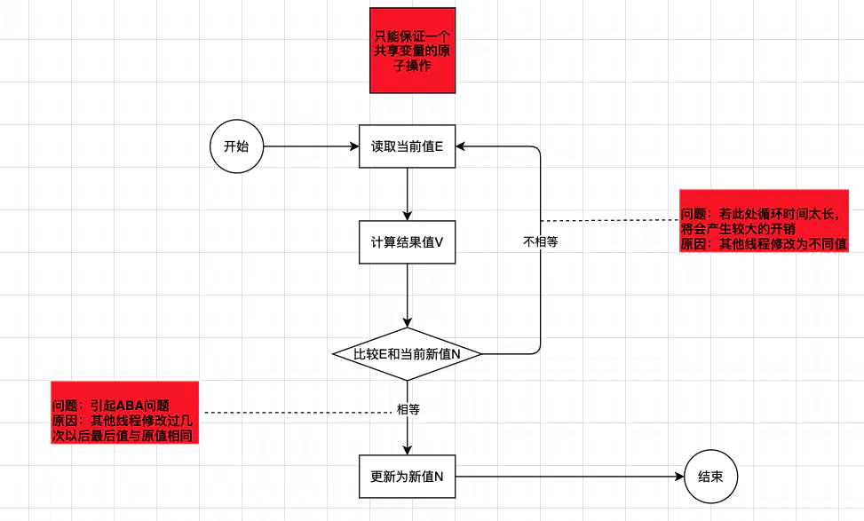
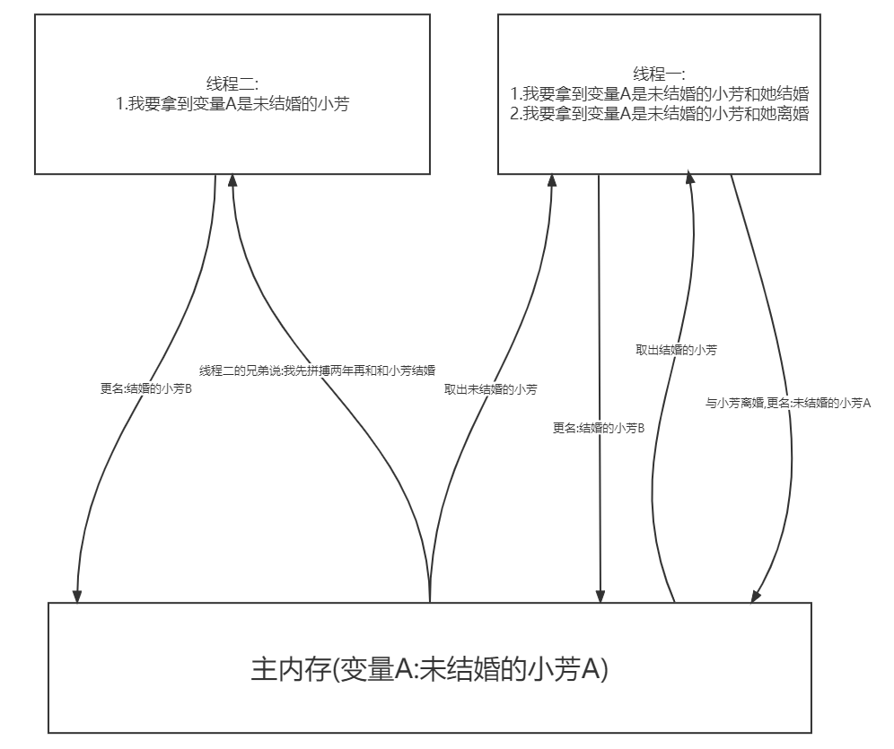

# 高并发锁笔记记录
## CAS
### 从三个方面介绍CAS
> 1. CAS的理论概念及底层原理
> 2. CAS产生ABA问题的原因
> 3. CAS产生的ABA问题的处理办法

**1. CAS的理论概念及底层原理**
- **理论介绍:**

上篇介绍了volatile解决高并发下可见性问题,但volatile不保证原子性,当时处理的办法是使用CAS去处理.不太清楚的可以查阅上篇的文章

> CAS:CAS全称(CompareAndSwap),从命名可以看出来**比较并替换**. 下面请看图


> 从主内存中取出变量值,经过一顿的业务计算后,用`原语`再去比较一次主内存的值是否和当时去的值一致,是的话更新主内存的值,否则重新取主内存的值重新进行操作

- **相关源码**

```java
public class AtomicInteger extends Number implements java.io.Serializable{
    //假设想要改变的变量名为：int a
    //o----->表示当前需要改变的变量 a 所在的对象
    //offset----->表示当前需要改变的变量 a 在 o 里的偏移量
    //expected---->表示 a 当前的预期值
    //x----------->表示要更改 a 的值为 x
    //返回 true 表示更改 a=x 成功
    public final native boolean compareAndSwapInt(Object var1, long var2, int var4, int var5);
}
```
该方法是Java的native方法,不是Java语言实现的,实现在` Unsafe.cpp`中:
```C++
UNSAFE_ENTRY(jboolean, Unsafe_CompareAndSwapInt(JNIEnv *env, jobject unsafe, jobject obj, jlong offset, jint e, jint x))
    UnsafeWrapper("Unsafe_CompareAndSwapInt");
    oop p = JNIHandles::resolve(obj);
    jint* addr = (jint *) index_oop_from_field_offset_long(p, offset);
    return (jint)(Atomic::cmpxchg(x, addr, e)) == e;
UNSAFE_END
```
> **Unsafe_CompareAndSwapInt** 传入的参数中的 **obj + offset** 共同确定了变量在对象中的地址，然后用指针 **`jint* addr`** 指向它，最后调用了 **Atomic** 的 **cmpxchg()** 方法，该方法是插入到 C++ 文件里的汇编指令。

**2. CAS产生ABA问题的原因**
> 简单点说就是:你是线程2,想和未结婚的小芳结婚,但是你说想拼搏两年再说,可是线程1比你快点,线程1与小芳结婚了,然后又离婚了.
> 你拼搏两年后,你发现小芳还是单身,于是你们两结婚了!(可能两年后,你们刚相遇不到两个月,小芳却怀了5个月的孩子.哈哈哈..TM的搞笑了)

- **相关源码**
```java
public class ABADemo {
    public static void main(String[] args) {
        System.out.println("================以下是ABA问题产生============");
        AtomicReference<Integer> atomicReference = new AtomicReference(100);
        new Thread(() -> {
            atomicReference.compareAndSet(100, 101);
            atomicReference.compareAndSet(101, 100);
        }, "t1").start();
        new Thread(() -> {
            try {
                TimeUnit.SECONDS.sleep(2);
            } catch (InterruptedException e) {
                e.printStackTrace();
            }
            System.out.printf("", atomicReference.compareAndSet(100, 2019) + "\t" + atomicReference.toString());
        }, "t2").start();
    }
}
```
**3. CAS产生的ABA问题的处理办法**
> 加入版本号(上面例子:去民政局查记录)

不聊了,有点伤感,也挺好理解的,大家直接看代码吧!
```java
public class ABADemo {
    public static void main(String[] args) {
        System.out.println("=============以下是ABA问题解决==============");
        AtomicStampedReference<Integer> atomicStampedReference = new AtomicStampedReference<>(100, 1);
        new Thread(() -> {
            int getAtomicStamp = atomicStampedReference.getStamp();
            System.out.println(Thread.currentThread().getName() + "\t 第一次版本号:" + atomicStampedReference.getStamp());
            try {
                TimeUnit.SECONDS.sleep(2);
            } catch (InterruptedException e) {
                e.printStackTrace();
            }
            atomicStampedReference.compareAndSet(100, 101, atomicStampedReference.getStamp(), atomicStampedReference.getStamp() + 1);
            System.out.println(Thread.currentThread().getName() + "\t 第二次版本号:" + atomicStampedReference.getStamp());
            atomicStampedReference.compareAndSet(101, 100, atomicStampedReference.getStamp(), atomicStampedReference.getStamp() + 1);
            System.out.println(Thread.currentThread().getName() + "\t 第三次版本号:" + atomicStampedReference.getStamp());
        }, "t3").start();
        new Thread(() -> {
            int getAtomicStamp = atomicStampedReference.getStamp();
            System.out.println(Thread.currentThread().getName() + "\t 第1次版本号:" + atomicStampedReference.getStamp());
            try {
                TimeUnit.SECONDS.sleep(5);
            } catch (InterruptedException e) {
                e.printStackTrace();
            }
            System.out.printf(atomicStampedReference.compareAndSet(100, 2019, getAtomicStamp, getAtomicStamp + 1) + "\t" + atomicStampedReference.getReference().toString());
            System.out.println(Thread.currentThread().getName() + "\t 第2次版本号:" + atomicStampedReference.getStamp());
        }, "t4").start();
    }
}
```
<details>
<summary>CLICK ME</summary>

**<summary>标签与正文间一定要空一行！！！**
</details>
