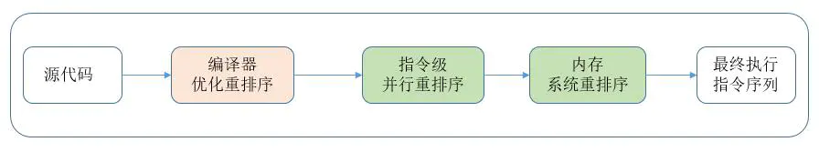

# 高并发锁笔记记录
## volatile
**特性**
- 可见性  
```textmate
可见性: 当一个线程更新主内存的变量值,即刻通知其他线程重新读取该内存变量值
```
- 不保证原子性  
```textmate
原子性: 操作不可分割,当一个线程操作某个业务时候,中间不可进行加塞,保证这个过程是完整的,要么同时成功要么同时失败.
```
- 禁止指令重排
```textmate
指令重排: JVM在编译Java代码的时候，或者CPU在执行JVM字节码的时候，对现有的指令顺序进行重新排序.为了在执行程序时提高性能,编辑器和处理器常常会对指令做重排
```


**例子(代码说明)**
- **可见性**
```java
class MyData {
    volatile int number = 0;
    public void AddNumber() {
        this.number = 60;
    }
}
public class MainBases01 {
    public static void main(String[] args) throws InterruptedException {
        MyData myData = new MyData();
//        第一个线程
        new Thread(() -> {
            System.out.println(Thread.currentThread().getName() + "\t come in!  myData.number=" + myData.number);
            try {
                Thread.sleep(500);
            } catch (InterruptedException e) {
                e.printStackTrace();
            }
            myData.AddNumber();
            System.out.println(Thread.currentThread().getName() + "\t AddNumber()!  myData.number=" + myData.number);
        }, "AAA").start();

        //验证可见性方法一:可以另起一个线程  可以感知到第一个线程感知到被volatile修饰的number值
        new Thread(()->{
            System.out.println(Thread.currentThread().getName()+"\t come in!  myData.number="+myData.number);
            try {
                Thread.sleep(1000);
            } catch (InterruptedException e) {
                e.printStackTrace();
            }
            System.out.println(Thread.currentThread().getName()+"\t myData.AddNumber()!  myData.number="+myData.number);
        },"BBB").start();
//        验证可见性方法二:在main线程进行验证,没有加volatile修饰的话下面这个会一直循环.
//        while (myData.number == 0) {
//        }
        System.out.println(Thread.currentThread().getName() + "\t myData.number=" + myData.number);
    }
}
```
- **不保证原子性**
```java
class MyData {
    volatile int number = 0;
    AtomicInteger atomicInteger=new AtomicInteger();
    public void AddNumber() {
        this.number = 60;
    }
    public void AddPlus() {
        this.number++;
    }
    public void AddAtomicInteger(){
        atomicInteger.getAndIncrement();
    }
}
public class MainBases01 {
    public static void main(String[] args) throws InterruptedException {
        MyData myData = new MyData();
        for (int i = 0; i < 20; i++) {
            new Thread(()->{
                for (int j = 0; j < 1000; j++) {
                    myData.AddPlus();
                    myData.AddAtomicInteger();
                }
            },String.valueOf(i)).start();
        }
        while (Thread.activeCount()>2){//一个main线程,另一个是GC线程
            Thread.yield();
        }
        System.out.println("验证volatile的原子性"+myData.number);
    }
}
```
**不保证原子性的解决办法**
```java
class MyData {
    AtomicInteger atomicInteger=new AtomicInteger();//定义AtomicInteger 该类保证原子性
    public void AddAtomicInteger(){
        atomicInteger.getAndIncrement();
    }
}
```
- AtomicInteger的**源码剖析**
>原理也很简单,就是使用了unsafe类getAndAddInt()方法

>**原理就是CAS方法:** 利用native修饰的compareAndSwapInt()(也被叫做:本地方法,这个方法是可以被C语言重写).
>
>**理论过程原理:** 就是一直循环进行变量比较并交换原则:比较主内存的值是否和期望值一致,一致的话就进行交换主内存的值.[CAS下次再细讲OK?]
```java

//
public final class Unsafe {
    public final int getAndAddInt(Object var1, long var2, int var4) {
        int var5;
        do {
            var5 = this.getIntVolatile(var1, var2);
        } while(!this.compareAndSwapInt(var1, var2, var5, var5 + var4));
        return var5;
    }
    //定义的compareAndSwapInt()方法是native修饰
    public final native boolean compareAndSwapInt(Object var1, long var2, int var4, int var5);
}
```
**禁止指令重排**

指令重排的概念
```textmate
    1--->  int a = 2  << 1;
    2--->  int b = 3 << 1;
    3--->  int result = a * b + 2333;
```
> 相信你看到这段简短的代码，也会知道这段代码的执行顺序，1 - > 2 -> 3,相信你会觉得这就是代码执行的顺序，但是在jvm中是不会这样执行的，这里我们可以用着三个变量的依赖关系来解释一下原因

> 这三个变量中 1 与 2没有依赖关系，3与 1和2 都有依赖关系，也就是说，没有依赖关系的两段代码即使我们将他们编译执行的顺序进行调换，这样也不会对代码的结果产生改变 也就是 上面的代码在jvm中实际上是 2 -> 1 -> 3

> 当然在单线程中JVM对代码进行指令重排并不会产生影响，但是在多线程中进行指令重排的话就会产生一些不确定的结果了，现在我们来看一下指令重排在多线程的一个经典的例子，单例模式，懒加载
```java
public class Test {
    private static Test instance = null;

    public static Test getSingInstance() {
        if (instance == null) {
            synchronized (Test.class) {
                instance = new Test();
            }
        }
        return  instance;
    }
    public void action() {
        System.out.println(">>>>>>>>>>");
    }

    public static void main(String[] args) {

    }
}
```
- 可以自己反编译进行查看(如上的类反编译如下)
```textmate
Classfile /D:/demo/target/classes/com/example/demo/Volatile/Test.class
  Last modified 2022-5-15; size 978 bytes
  MD5 checksum f0d641de5be26149e162978843fd9c90
  Compiled from "Test.java"
public class com.example.demo.Volatile.Test
  minor version: 0
  major version: 52
  flags: ACC_PUBLIC, ACC_SUPER
Constant pool:
   #1 = Methodref          #8.#31         // java/lang/Object."<init>":()V
   #2 = Fieldref           #3.#32         // com/example/demo/Volatile/Test.instance:Lcom/example/demo/Volatile/Test;
   #3 = Class              #33            // com/example/demo/Volatile/Test
   #4 = Methodref          #3.#31         // com/example/demo/Volatile/Test."<init>":()V
   #5 = Fieldref           #34.#35        // java/lang/System.out:Ljava/io/PrintStream;
   #6 = String             #36            // >>>>>>>>>>
   #7 = Methodref          #37.#38        // java/io/PrintStream.println:(Ljava/lang/String;)V
   #8 = Class              #39            // java/lang/Object
   #9 = Utf8               instance
  #10 = Utf8               Lcom/example/demo/Volatile/Test;
  #11 = Utf8               <init>
  #12 = Utf8               ()V
  #13 = Utf8               Code
  #14 = Utf8               LineNumberTable
  #15 = Utf8               LocalVariableTable
  #16 = Utf8               this
  #17 = Utf8               getSingInstance
  #18 = Utf8               ()Lcom/example/demo/Volatile/Test;
  #19 = Utf8               StackMapTable
  #20 = Class              #39            // java/lang/Object
  #21 = Class              #40            // java/lang/Throwable
  #22 = Utf8               action
  #23 = Utf8               main
  #24 = Utf8               ([Ljava/lang/String;)V
  #25 = Utf8               args
  #26 = Utf8               [Ljava/lang/String;
  #27 = Utf8               MethodParameters
  #28 = Utf8               <clinit>
  #29 = Utf8               SourceFile
  #30 = Utf8               Test.java
  #31 = NameAndType        #11:#12        // "<init>":()V
  #32 = NameAndType        #9:#10         // instance:Lcom/example/demo/Volatile/Test;
  #33 = Utf8               com/example/demo/Volatile/Test
  #34 = Class              #41            // java/lang/System
  #35 = NameAndType        #42:#43        // out:Ljava/io/PrintStream;
  #36 = Utf8               >>>>>>>>>>
  #37 = Class              #44            // java/io/PrintStream
  #38 = NameAndType        #45:#46        // println:(Ljava/lang/String;)V
  #39 = Utf8               java/lang/Object
  #40 = Utf8               java/lang/Throwable
  #41 = Utf8               java/lang/System
  #42 = Utf8               out
  #43 = Utf8               Ljava/io/PrintStream;
  #44 = Utf8               java/io/PrintStream
  #45 = Utf8               println
  #46 = Utf8               (Ljava/lang/String;)V
{
  public com.example.demo.Volatile.Test();
    descriptor: ()V
    flags: ACC_PUBLIC
    Code:
      stack=1, locals=1, args_size=1
         0: aload_0
         1: invokespecial #1                  // Method java/lang/Object."<init>":()V
         4: return
      LineNumberTable:
        line 3: 0
      LocalVariableTable:
        Start  Length  Slot  Name   Signature
            0       5     0  this   Lcom/example/demo/Volatile/Test;

  public static com.example.demo.Volatile.Test getSingInstance();
    descriptor: ()Lcom/example/demo/Volatile/Test;
    flags: ACC_PUBLIC, ACC_STATIC
    Code:
      stack=2, locals=2, args_size=0
         0: getstatic     #2                  // Field instance:Lcom/example/demo/Volatile/Test;
         3: ifnonnull     31
         6: ldc           #3                  // class com/example/demo/Volatile/Test
         8: dup
         9: astore_0
        10: monitorenter
        11: new           #3                  // class com/example/demo/Volatile/Test
        14: dup
        15: invokespecial #4                  // Method "<init>":()V
        18: putstatic     #2                  // Field instance:Lcom/example/demo/Volatile/Test;
        21: aload_0
        22: monitorexit
        23: goto          31
        26: astore_1
        27: aload_0
        28: monitorexit
        29: aload_1
        30: athrow
        31: getstatic     #2                  // Field instance:Lcom/example/demo/Volatile/Test;
        34: areturn
      Exception table:
         from    to  target type
            11    23    26   any
            26    29    26   any
      LineNumberTable:
        line 7: 0
        line 8: 6
        line 9: 11
        line 10: 21
        line 12: 31
      StackMapTable: number_of_entries = 2
        frame_type = 255 /* full_frame */
          offset_delta = 26
          locals = [ class java/lang/Object ]
          stack = [ class java/lang/Throwable ]
        frame_type = 250 /* chop */
          offset_delta = 4

  public void action();
    descriptor: ()V
    flags: ACC_PUBLIC
    Code:
      stack=2, locals=1, args_size=1
         0: getstatic     #5                  // Field java/lang/System.out:Ljava/io/PrintStream;
         3: ldc           #6                  // String >>>>>>>>>>
         5: invokevirtual #7                  // Method java/io/PrintStream.println:(Ljava/lang/String;)V
         8: return
      LineNumberTable:
        line 15: 0
        line 16: 8
      LocalVariableTable:
        Start  Length  Slot  Name   Signature
            0       9     0  this   Lcom/example/demo/Volatile/Test;

  public static void main(java.lang.String[]);
    descriptor: ([Ljava/lang/String;)V
    flags: ACC_PUBLIC, ACC_STATIC
    Code:
      stack=0, locals=1, args_size=1
         0: return
      LineNumberTable:
        line 20: 0
      LocalVariableTable:
        Start  Length  Slot  Name   Signature
            0       1     0  args   [Ljava/lang/String;
    MethodParameters:
      Name                           Flags
      args

  static {};
    descriptor: ()V
    flags: ACC_STATIC
    Code:
      stack=1, locals=0, args_size=0
         0: aconst_null
         1: putstatic     #2                  // Field instance:Lcom/example/demo/Volatile/Test;
         4: return
      LineNumberTable:
        line 4: 0
}
SourceFile: "Test.java"
```
看不懂的可以查阅相关字典(字节码字典字典如下)

|字节码 | 助记符 | 指令含义 |
|-------|------|--------|
|0x00|nop|	None|
|0x01|aconst_null|	将 null 推送至栈顶|
|0x02|iconst_m1|	将 int 型-1 推送至栈顶|
|0x03|iconst_0|	将 int 型 0 推送至栈顶|
|0x04|iconst_1|	将 int 型 1 推送至栈顶|
|0x05|iconst_2|	将 int 型 2 推送至栈顶|
|0x06|iconst_3|	将 int 型 3 推送至栈顶|
|0x07|iconst_4|	将 int 型 4 推送至栈顶|
|0x08|iconst_5|	将 int 型 5 推送至栈顶|
|0x09|lconst_0|	将 long 型 0 推送至栈顶|
|0x0a|lconst_1|	将 long 型 1 推送至栈顶|
|0x0b|fconst_0|	将 float 型 0 推送至栈顶|
|0x0c|fconst_1|	将 float 型 1 推送至栈顶|
|0x0d|fconst_2|	将 float 型 2 推送至栈顶|
|0x0e|dconst_0|	将 double 型 0 推送至栈顶|
|0x0f|dconst_1|	将 double 型 1 推送至栈顶|
|0x10|bipush|	将单字节的常量值 (-128~127) 推送至栈顶|
|0x11|sipush|	将一个短整型常量 (-32768~32767) 推送至栈顶|
|0x12|ldc|	将 int,float 或 String 型常量值从常量池中推送至栈顶|
|0x13|ldc_w|	将 int,float 或 String 型常量值从常量池中推送至栈顶 (宽索引)|
|0x14|ldc2_w|	将 long 或 double 型常量值从常量池中推送至栈顶 (宽索引)|
|0x15|iload|	将指定的 int 型本地变量推送至栈顶|
|0x16|lload|	将指定的 long 型本地变量推送至栈顶|
|0x17|fload|	将指定的 float 型本地变量推送至栈顶|
|0x18|dload|	将指定的 double 型本地变量推送至栈顶|
|0x19|aload|	将指定的引用类型本地变量推送至栈顶|
|0x1a|iload_0|	将第一个 int 型本地变量推送至栈顶|
|0x1b|iload_1|	将第二个 int 型本地变量推送至栈顶|
|0x1c|iload_2|	将第三个 int 型本地变量推送至栈顶|
|0x1d|iload_3|	将第四个 int 型本地变量推送至栈顶|
|0x1e|lload_0|	将第一个 long 型本地变量推送至栈顶|
|0x1f|lload_1|	将第二个 long 型本地变量推送至栈顶|
|0x20|lload_2|	将第三个 long 型本地变量推送至栈顶|
|0x21|lload_3|	将第四个 long 型本地变量推送至栈顶|
|0x22|fload_0|	将第一个 float 型本地变量推送至栈顶|
|0x23|fload_1|	将第二个 float 型本地变量推送至栈顶|
|0x24|fload_2|	将第三个 float 型本地变量推送至栈顶|
|0x25|fload_3|	将第四个 float 型本地变量推送至栈顶|
|0x26|dload_0|	将第一个 double 型本地变量推送至栈顶|
|0x27|dload_1|	将第二个 double 型本地变量推送至栈顶|
|0x28|dload_2|	将第三个 double 型本地变量推送至栈顶|
|0x29|dload_3|	将第四个 double 型本地变量推送至栈顶|
|0x2a|aload_0|	将第一个引用类型本地变量推送至栈顶|
|0x2b|aload_1|	将第二个引用类型本地变量推送至栈顶|
|0x2c|aload_2|	将第三个引用类型本地变量推送至栈顶|
|0x2d|aload_3|	将第四个引用类型本地变量推送至栈顶|
|0x2e|iaload|	将 int 型数组指定索引的值推送至栈顶|
|0x2f|laload|	将 long 型数组指定索引的值推送至栈顶|
|0x30|faload|	将 float 型数组指定索引的值推送至栈顶|
|0x31|daload|	将 double 型数组指定索引的值推送至栈顶|
|0x32|aaload|	将引用类型数组指定索引的值推送至栈顶|
|0x33|baload|	将 boolean 或 byte 型数组指定索引的值推送至栈顶|
|0x34|caload|	将 char 型数组指定索引的值推送至栈顶|
|0x35|saload|	将 short 型数组指定索引的值推送至栈顶|
|0x36|istore|	将栈顶 int 型数值存入指定本地变量|
|0x37|lstore|	将栈顶 long 型数值存入指定本地变量|
|0x38|fstore|	将栈顶 float 型数值存入指定本地变量|
|0x39|dstore|	将栈顶 double 型数值存入指定本地变量|
|0x3a|astore|	将栈顶引用类型数值存入指定本地变量|
|0x3b|istore_0|	将栈顶 int 型数值存入第一个本地变量|
|0x3c|istore_1|	将栈顶 int 型数值存入第二个本地变量|
|0x3d|istore_2|	将栈顶 int 型数值存入第三个本地变量|
|0x3e|istore_3|	将栈顶 int 型数值存入第四个本地变量|
|0x3f|lstore_0|	将栈顶 long 型数值存入第一个本地变量|
|0x40|lstore_1|	将栈顶 long 型数值存入第二个本地变量|
|0x41|lstore_2|	将栈顶 long 型数值存入第三个本地变量|
|0x42|lstore_3|	将栈顶 long 型数值存入第四个本地变量|
|0x43|fstore_0|	将栈顶 float 型数值存入第一个本地变量|
|0x44|fstore_1|	将栈顶 float 型数值存入第二个本地变量|
|0x45|fstore_2|	将栈顶 float 型数值存入第三个本地变量|
|0x46|fstore_3|	将栈顶 float 型数值存入第四个本地变量|
|0x47|dstore_0|	将栈顶 double 型数值存入第一个本地变量|
|0x48|dstore_1|	将栈顶 double 型数值存入第二个本地变量|
|0x49|dstore_2|	将栈顶 double 型数值存入第三个本地变量|
|0x4a|dstore_3|	将栈顶 double 型数值存入第四个本地变量|
|0x4b|astore_0|	将栈顶引用型数值存入第一个本地变量|
|0x4c|astore_1|	将栈顶引用型数值存入第二个本地变量|
|0x4d|astore_2|	将栈顶引用型数值存入第三个本地变量|
|0x4e|astore_3|	将栈顶引用型数值存入第四个本地变量|
|0x4f|iastore|	将栈顶 int 型数值存入指定数组的指定索引位置|
|0x50|lastore|	将栈顶 long 型数值存入指定数组的指定索引位置|
|0x51|fastore|	将栈顶 float 型数值存入指定数组的指定索引位置|
|0x52|dastore|	将栈顶 double 型数值存入指定数组的指定索引位置|
|0x53|aastore|	将栈顶引用型数值存入指定数组的指定索引位置|
|0x54|bastore|	将栈顶 boolean 或 byte 型数值存入指定数组的指定索引位置|
|0x55|castore|	将栈顶 char 型数值存入指定数组的指定索引位置|
|0x56|sastore|	将栈顶 short 型数值存入指定数组的指定索引位置|
|0x57|pop|	将栈顶数值弹出 (数值不能是 long 或 double 类型的)|
|0x58|pop2|	将栈顶的一个 (对于非 long 或 double 类型) 或两个数值 (对于非 long 或 double 的其他类型) 弹出|
|0x59|dup|	复制栈顶数值并将复制值压入栈顶|
|0x5a|dup_x1|	复制栈顶数值并将两个复制值压入栈顶|
|0x5b|dup_x2|	复制栈顶数值并将三个 (或两个) 复制值压入栈顶|
|0x5c|dup2|	复制栈顶一个 (对于 long 或 double 类型) 或两个 (对于非 long 或 double 的其他类型) 数值并将复制值压入栈顶|
|0x5d|dup2_x1|	dup_x1 指令的双倍版本|
|0x5e|dup2_x2|	dup_x2 指令的双倍版本|
|0x5f|swap|	将栈顶最顶端的两个数值互换 (数值不能是 long 或 double 类型)|
|0x60|iadd|	将栈顶两 int 型数值相加并将结果压入栈顶|
|0x61|ladd|	将栈顶两 long 型数值相加并将结果压入栈顶|
|0x62|fadd|	将栈顶两 float 型数值相加并将结果压入栈顶|
|0x63|dadd|	将栈顶两 double 型数值相加并将结果压入栈顶|
|0x64|isub|	将栈顶两 int 型数值相减并将结果压入栈顶|
|0x65|lsub|	将栈顶两 long 型数值相减并将结果压入栈顶|
|0x66|fsub|	将栈顶两 float 型数值相减并将结果压入栈顶|
|0x67|dsub|	将栈顶两 double 型数值相减并将结果压入栈顶|
|0x68|imul|	将栈顶两 int 型数值相乘并将结果压入栈顶|
|0x69|lmul|	将栈顶两 long 型数值相乘并将结果压入栈顶|
|0x6a|fmul|	将栈顶两 float 型数值相乘并将结果压入栈顶|
|0x6b|dmul|	将栈顶两 double 型数值相乘并将结果压入栈顶|
|0x6c|idiv|	将栈顶两 int 型数值相除并将结果压入栈顶|
|0x6d|ldiv|	将栈顶两 long 型数值相除并将结果压入栈顶|
|0x6e|fdiv|	将栈顶两 float 型数值相除并将结果压入栈顶|
|0x6f|ddiv|	将栈顶两 double 型数值相除并将结果压入栈顶|
|0x70|irem|	将栈顶两 int 型数值作取模运算并将结果压入栈顶|
|0x71|lrem|	将栈顶两 long 型数值作取模运算并将结果压入栈顶|
|0x72|frem|	将栈顶两 float 型数值作取模运算并将结果压入栈顶|
|0x73|drem|	将栈顶两 double 型数值作取模运算并将结果压入栈顶|
|0x74|ineg|	将栈顶 int 型数值取负并将结果压入栈顶|
|0x75|lneg|	将栈顶 long 型数值取负并将结果压入栈顶|
|0x76|fneg|	将栈顶 float 型数值取负并将结果压入栈顶|
|0x77|dneg|	将栈顶 double 型数值取负并将结果压入栈顶|
|0x78|ishl|	将 int 型数值左移指定位数并将结果压入栈顶|
|0x79|lshl|	将 long 型数值左移指定位数并将结果压入栈顶|
|0x7a|ishr|	将 int 型数值右 (带符号) 移指定位数并将结果压入栈顶|
|0x7b|lshr|	将 long 型数值右 (带符号) 移指定位数并将结果压入栈顶|
|0x7c|iushr|	将 int 型数值右 (无符号) 移指定位数并将结果压入栈顶|
|0x7d|lushr|	将 long 型数值右 (无符号) 移指定位数并将结果压入栈顶|
|0x7e|iand|	将栈顶两 int 型数值"按位与"并将结果压入栈顶|
|0x7f|land|	将栈顶两 long 型数值"按位与"并将结果压入栈顶|
|0x80|ior|	将栈顶两 int 型数值"按位或"并将结果压入栈顶|
|0x81|lor|	将栈顶两 long 型数值"按位或"并将结果压入栈顶|
|0x82|ixor|	将栈顶两 int 型数值"按位异或"并将结果压入栈顶|
|0x83|lxor|	将栈顶两 long 型数值"按位异或"并将结果压入栈顶|
|0x84|iinc|	将指定 int 型变量增加指定值 (如 i++, i–, i+=2 等)|
|0x85|i2l|	将栈顶 int 型数值强制转换为 long 型数值并将结果压入栈顶|
|0x86|i2f|	将栈顶 int 型数值强制转换为 float 型数值并将结果压入栈顶|
|0x87|i2d|	将栈顶 int 型数值强制转换为 double 型数值并将结果压入栈顶|
|0x88|l2i|	将栈顶 long 型数值强制转换为 int 型数值并将结果压入栈顶|
|0x89|l2f|	将栈顶 long 型数值强制转换为 float 型数值并将结果压入栈顶|
|0x8a|l2d|	将栈顶 long 型数值强制转换为 double 型数值并将结果压入栈顶|
|0x8b|f2i|	将栈顶 float 型数值强制转换为 int 型数值并将结果压入栈顶|
|0x8c|f2l|	将栈顶 float 型数值强制转换为 long 型数值并将结果压入栈顶|
|0x8d|f2d|	将栈顶 float 型数值强制转换为 double 型数值并将结果压入栈顶|
|0x8e|d2i|	将栈顶 double 型数值强制转换为 int 型数值并将结果压入栈顶|
|0x8f|d2l|	将栈顶 double 型数值强制转换为 long 型数值并将结果压入栈顶|
|0x90|d2f|	将栈顶 double 型数值强制转换为 float 型数值并将结果压入栈顶|
|0x91|i2b|	将栈顶 int 型数值强制转换为 byte 型数值并将结果压入栈顶|
|0x92|i2c|	将栈顶 int 型数值强制转换为 char 型数值并将结果压入栈顶|
|0x93|i2s|	将栈顶 int 型数值强制转换为 short 型数值并将结果压入栈顶|
|0x94|lcmp|	比较栈顶两 long 型数值大小, 并将结果 (1, 0 或-1) 压入栈顶|
|0x95|fcmpl|	比较栈顶两 float 型数值大小, 并将结果 (1, 0 或-1) 压入栈顶;当其中一个数值为 NaN 时, 将-1 压入栈顶|
|0x96|fcmpg|	比较栈顶两 float 型数值大小, 并将结果 (1, 0 或-1) 压入栈顶;当其中一个数值为 NaN 时, 将 1 压入栈顶|
|0x97|dcmpl|	比较栈顶两 double 型数值大小, 并将结果 (1, 0 或-1) 压入栈顶;当其中一个数值为 NaN 时, 将-1 压入栈顶|
|0x98|dcmpg|	比较栈顶两 double 型数值大小, 并将结果 (1, 0 或-1) 压入栈顶;当其中一个数值为 NaN 时, 将 1 压入栈顶|
|0x99|ifeq|	当栈顶 int 型数值等于 0 时跳转|
|0x9a|ifne|	当栈顶 int 型数值不等于 0 时跳转|
|0x9b|iflt|	当栈顶 int 型数值小于 0 时跳转|
|0x9c|ifge|	当栈顶 int 型数值大于等于 0 时跳转|
|0x9d|ifgt|	当栈顶 int 型数值大于 0 时跳转|
|0x9e|ifle|	当栈顶 int 型数值小于等于 0 时跳转|
|0x9f|if_icmpeq|	比较栈顶两 int 型数值大小, 当结果等于 0 时跳转|
|0xa0|if_icmpne|	比较栈顶两 int 型数值大小, 当结果不等于 0 时跳转|
|0xa1|if_icmplt|	比较栈顶两 int 型数值大小, 当结果小于 0 时跳转|
|0xa2|if_icmpge|	比较栈顶两 int 型数值大小, 当结果大于等于 0 时跳转|
|0xa3|if_icmpgt|	比较栈顶两 int 型数值大小, 当结果大于 0 时跳转|
|0xa4|if_icmple|	比较栈顶两 int 型数值大小, 当结果小于等于 0 时跳转|
|0xa5|if_acmpeq|	比较栈顶两引用型数值, 当结果相等时跳转|
|0xa6|if_acmpne|	比较栈顶两引用型数值, 当结果不相等时跳转|
|0xa7|goto|	无条件跳转|
|0xa8|jsr|	跳转至指定的 16 位 offset 位置, 并将 jsr 的下一条指令地址压入栈顶|
|0xa9|ret|	返回至本地变量指定的 index 的指令位置 (一般与 jsr 或 jsr_w 联合使用)|
|0xaa|tableswitch|	用于 switch 条件跳转, case 值连续 (可变长度指令)|
|0xab|lookupswitch|	用于 switch 条件跳转, case 值不连续 (可变长度指令)|
|0xac|ireturn|	从当前方法返回 int|
|0xad|lreturn|	从当前方法返回 long|
|0xae|freturn|	从当前方法返回 float|
|0xaf|dreturn|	从当前方法返回 double|
|0xb0|areturn|	从当前方法返回对象引用|
|0xb1|return|	从当前方法返回 void|
|0xb2|getstatic|	获取指定类的静态域, 并将其压入栈顶|
|0xb3|putstatic|	为指定类的静态域赋值|
|0xb4|getfield|	获取指定类的实例域, 并将其压入栈顶|
|0xb5|putfield|	为指定类的实例域赋值|
|0xb6|invokevirtual|	调用实例方法|
|0xb7|invokespecial|	调用超类构建方法, 实例初始化方法, 私有方法|
|0xb8|invokestatic|	调用静态方法|
|0xb9|invokeinterface|	调用接口方法|
|0xba|invokedynamic|	调用动态方法|
|0xbb|new|	创建一个对象, 并将其引用引用值压入栈顶|
|0xbc|newarray|	创建一个指定的原始类型 (如 int, float, char 等) 的数组,并将其引用值压入栈顶|
|0xbd|anewarray|	创建一个引用型 (如类, 接口, 数组) 的数组, 并将其引用值压入栈顶|
|0xbe|arraylength|	获取数组的长度值并压入栈顶|
|0xbf|athrow|	将栈顶的异常抛出|
|0xc0|checkcast|	检验类型转换, 检验未通过将抛出 ClassCastException|
|0xc1|instanceof|	检验对象是否是指定类的实际, 如果是将 1 压入栈顶, 否则将 0 压入栈顶|
|0xc2|monitorenter|	获得对象的锁, 用于同步方法或同步块|
|0xc3|monitorexit|	释放对象的锁, 用于同步方法或同步块|
|0xc4|wide|	扩展本地变量的宽度|
|0xc5|multianewarray|	创建指定类型和指定维度的多维数组 (执行该指令时,操作栈中必须包含各维度的长度值), 并将其引用压入栈顶|
|0xc6|ifnull|	为 null 时跳转|
|0xc7|ifnonnull|	不为 null 时跳转|
|0xc8|goto_w|	无条件跳转 (宽索引)|
|0xc9|jsr_w|	跳转至指定的 32 位 offset 位置, 并将 jsr_w 的下一条指令地址压入栈顶|

看似一句简单的`instance = new Test();` 实际分三步
> - memory =allocate();    //1：分配对象的内存空间
> - ctorInstance(memory);  //2：初始化对象
> - instance =memory;     //3：设置instance指向刚分配的内存地址 

可以看出第一条指令和第二条指令有依赖关系, 但第三条指令和另外两条指令就没有依赖关系,这时候`JVM`指令重排1->3->2
那么问题来了, 执行1后就分配了内存空间,再执行3判断instance!=null.但是还没完成初始化就会运行报错了!所以加上volatile来禁止指令重排.


